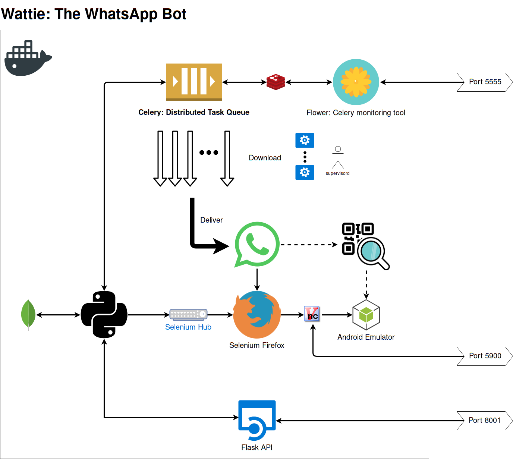

# Wattie the WhatsApp bot

**This repository is a work in progress open source project. It is in the process of being migrated from a closed source project.**

Certain code has been cleaned using the [BFG Repo-Cleaner](https://rtyley.github.io/bfg-repo-cleaner/) - here you will see **REMOVED**.

---

# Components



---

## Directories

```
.vscode/            ptsvd debugging is configured in the `launch.json` file
data/               cookie data, session data, and uptime logs are stored here
diagrams/           a single system diagram
domain/             a domain object is an entity in the domain layer of your application, something a business level exec should understand
downloads/          all media downloads, both temporary and for users, are stored here
logging_config/     self commenting really
logs/               logs...
task_queue/         configuration of Celery, queues, and tasks
whatsapp/           all direct interaction with WhatsApp web with Selenium
```

## SessionManager Class

Class for managing active Selenium session via Selenium Hub & Selenium Node:

* Restarting/refreshing driver session
* Persisting last session for reloading
* Monitoring uptime and restarting services when necessary

### UptimeManager Class

Class used for logging session uptime during operation.

## ScheduleManager Class

Class for handling scheduled REMOVED deliveries and pushing to Celery task queues.

## API Module

The API provides the following functionality:

1. Checking service health
2. Manually starting schedule handling
3. Sending WhatsApp messages

All transaction are routed through the API. The benefit of routing all transactions via the API is that we can use ElasticAPM to provide performance metrics e.g. the time it takes to deliver a REMOVED.

## FileManager Class

The FileManager handles the following tasks:

1. Downloading files to be delivered
2. Purging downloaded files when appropriate
3. Tracking all files downloaded by creating a MongoDB entry
4. (Previously, scheduling deliveries)

## FirebaseManager Class

The FirebaseManager class manages the following:

1. FireStore database connection
2. Reading and updating user data
3. Fetching the relevant REMOVED active subscriptions and schedules

## LogManager/AlertManager/SMTPSHandler Class

The LogManager handles all log files.

The AlertManager is a work in progress that handles sending alerts via services like Slack.

The SMTPSHandler handles sending alerts via e-mail with screenshots of the active session.

## Supervisord & Celery Task Queue & Flower Task Manager

Supervisord manages starting the session, spinning up Celery workers, and the Flower admin portal. It allows parallel processing of task queues.

Celery workers are configured via Supervisord. These workers are given the path to the Python `tasks` module. The Celery config is handled in the `celery_config` module. 

The `celery_config` module handles setting up queues, their priority, and scheduling periodic tasks like user processing.

The `tasks` module uses decorators to define tasks and their behaviour. Tasks are usually appended to a queue using a `queue_{}` method.

## WhatsApp CLI & WhatsApp CLI Interface

The WhatsApp CLI is started as a Python subprocess via the WhatsApp CLI interface. This ensures that if there is a memory leak or if the process crashes it doesn't bring down the whole system.

The WhatsApp CLI handles all Selenium tasks and interfaces with the SessionManager to connect to the active driver session.

## WIP: WhatsAppReceive Class

The WhatsAppReceive class is a work in progress. It will handle the reception of WhatsApp messages, the automated replies, and user management. It can be extended in future to handle any task that requires reading of incomming messages. At the moment it is a utility class that is indepedant of the rest of the docker system... it should perhaps be in its own branch.

## Important Notes

* When the Docker stack is restarted, the SessionManager purges all tasks.
* The REMOVED delivery window is X hours before and after the current time: now-X >>> now >>> now+X
* A Delivery is a collection of content sent to a user, whereas a WhatsAppMessage is a message processed from a WhatsApp conversation.
* All transactions going through the API are monitored using ElasticAPM, certain tasks implement ElasticAPM transactions too.
* MongoDB is a legacy part of the application, which is not used - task queues with Redis have made it redundent.
* The WhatsAppProcess class has methods that are WIPs. One of which processes all messages (with limits) into MongoDB entries.

---

# Wattie v2.0-Docker Deployment

---

Wattie has been moved to a Docker multi-service container - it can now be started quickly without worrying about EC2 environment configuration.

## 1. Docker

`docker-compose up --build`

This will start a Docker container with **port 8001 exposed for API and 5900 exposed for VNC**.

## 2. Graphical VNC Viewer

Using your VNC viewer of choice connect to **localhost port 5900**, the following example uses **TigerVNC**:

`vncviewer localhost:5900`

> Password: 'secret'

## Amazon EC2 Config

Port 8001 needs to be open to incoming connections in order to use the API. VNC connections are done via SSH.

## Environment variables

### Host

The following environment variables need to be exported on the Docker host for the build to succeed.

**FIREBASE_CERTIFICATE_PATH**: The path to the directory holding the Firebase certificate e.g. /home/ec2-user/secrets

**FIREBASE_CERTIFICATE_NAME**: The name of the Firebase certificate e.g. REMOVED

**REMOVED_PASSWORD**: Password for general REMOVED authentication e.g. Flower

**AUTH_TOKEN**: Token to authorize API requests. 'X-Auth-Token' header entry in HTTP request.

e.g. `curl -H "X-Auth-Token: "$AUTH_TOKEN"" REMOVED:8001/health`

This means if the server is rebuilt, the actual Firebase certificate will need to be uploaded using `scp` and the relevant SSH key, for example:

See (Example syntax for Secure Copy)[http://www.hypexr.org/linux_scp_help.php]

`scp -i .ssh/ssh-key /home/yoda/secrets/REMOVED ubuntu@ec2-url.com:~/secrets`

### Docker-compose

**CELL_NUMBER**: The cell number of Wattie - used for health checks.

**MONITOR_FREQUENCY**: How often in seconds to check Wattie's health.

**TIMEOUT**: How long to wait in seconds before refreshing or restarting the connection.

## SSHing into EC2 host

Using the following SSH command is dual purpose, it both connects to the EC2 instance, and opens up the local port 5900 for VNC.

> ssh -i .ssh/aws-ssh-wattie.pem -L 5901:localhost:5900 ec2-user@REMOVED

## Flower: Celery interface

> Go to port 5555, with username **REMOVED** and password **REMOVED**

## Pruning Docker images

When using docker-compose, occasionaly you'll need to clear out hanging Docker images. This can be done using:

`docker system prune`

---

# Wattie v1.0 Deployment

---

# Run locally:

**Start mongo db:** ensure default config set
mongod

**Mongo shell:** database admin
mongo
use db-name
db.collection.action

**Start Session Manager:** whatsapp_cli.py called on separate thread for robustness
source venv/bin/activate
python session_manager.py

# Run on EC2 GRAPHICAL instance:

## Server instance users

There are two users set up:

`ubuntu` is the default EC2 user created when setting up a new EC2 instance - can be used for SSH and terminal tasks.

`wattie` is the user attached to the Linux graphical environment of choice - used when doing graphical tasks.

## SSH into instance

If you don't have an SSH key set up, you may need to do that first, otherwise do the following:

> ssh -i <ssh-key-file> ubuntu@REMOVED

## Install Firefox geckodriver

See https://askubuntu.com/questions/870530/how-to-install-geckodriver-in-ubuntu

> sudo apt-get upgrade
> sudo apt-get update
> sudo apt-get install firefox-esr
> curl -O https://github.com/mozilla/geckodriver/releases/download/v0.19.1/geckodriver-v0.19.1-arm7hf.tar.gz
> tar -xzvf geckodriver-v0.19.1-arm7hf.tar.gz
> sudo cp geckodriver /usr/local/bin/

## Configuring mongod service:

You may have to install MongoDB first.

### Create MongoDB service on server

See https://askubuntu.com/questions/748789/run-mongodb-service-as-daemon-of-systemd-on-ubuntu-15-10

Use the --smallfiles option when creating mongod service to stop the daemon from complaining about lack of storage space.

### Configure MongoDB working directories

> sudo mkdir -p /data/db/
> sudo chown `id -u` /data/db

### Start newly created MongoDB service which starts mongod as a daemon

> sudo service mongodb start

## Connecting to VNC Server

First SSH into the instance using the graphical user Wattie:

> ssh -L 5901:127.0.0.1:5901 wattie@REMOVED

password: REMOVED

Start the VNC server on extension 1, it may say that it is already running:

> vncserver :1 // starts vncserver on port 5901

Start local VNC viewer and connect to localhost:5901, with password 50Millio

When you close your SSH and VNC connection, Wattie will continue operating in graphical instance.

When in instance, you can switch to graphical wattie user as follows:

> su - wattie

## VNC Viewer complains about security issues

SSH into the instance and run the following command to reset the blacklist. This issue occurs if you enter the wrong VNC server password.

> vncconfig -display :1 -set BlacklistTimeout=0 -set BlacklistThreshold=1000000
